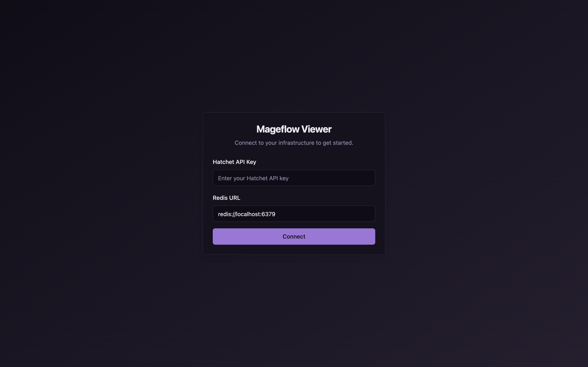
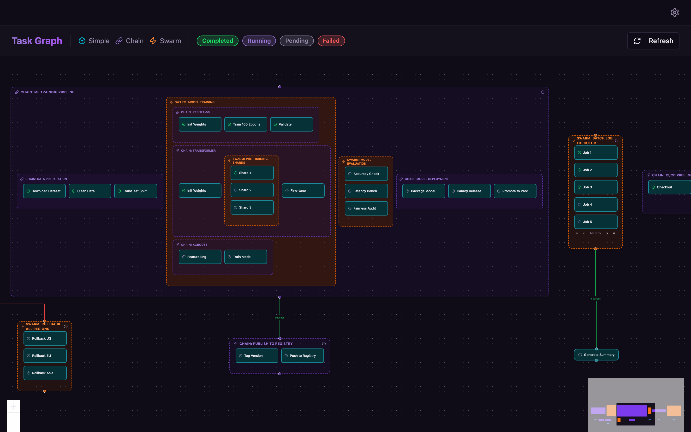
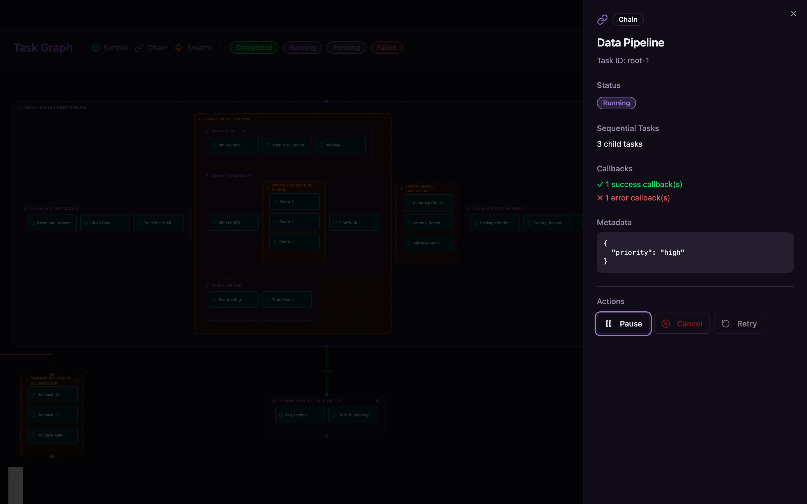
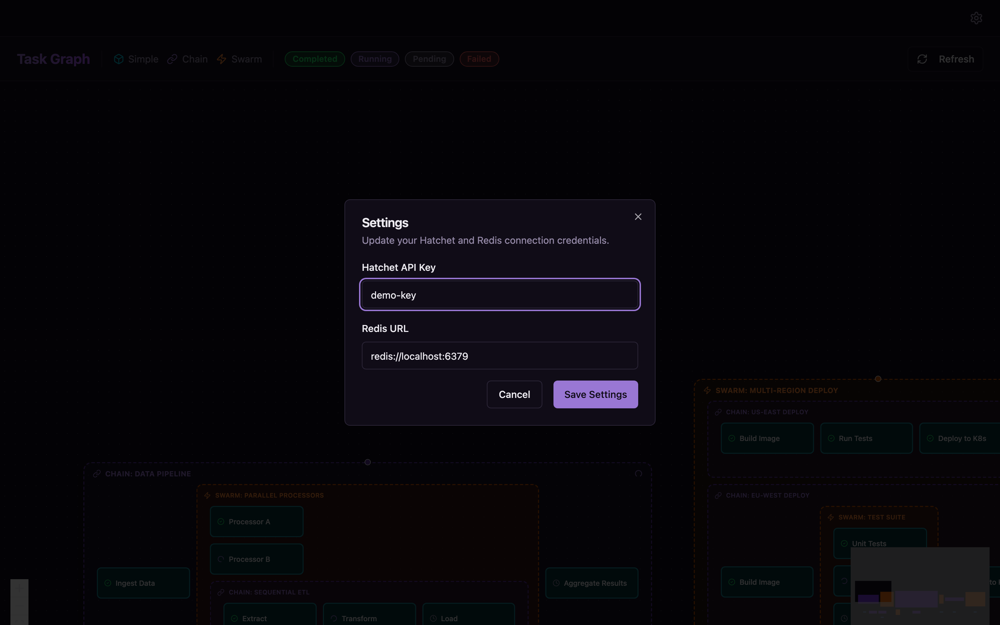

# MageFlow Viewer

Desktop app for visualizing mageflow workflows as interactive task graphs.

<!-- SCREENSHOT: Main task graph view showing workflow nodes and edges -->

## Installation

Download the latest release for your platform from [GitHub Releases](https://github.com/imaginary-cherry/mageflow/releases):

| Platform | Format |
|----------|--------|
| macOS (Apple Silicon) | `.dmg` |
| macOS (Intel) | `.dmg` |
| Windows | `.msi` |
| Linux | `.deb` / `.AppImage` |

!!! note "macOS unsigned app"
    The macOS build is currently unsigned. On first launch, right-click the app and select "Open", then confirm in the dialog.

## First Launch

On first launch, the onboarding screen asks for your connection details:

<!-- SCREENSHOT: Onboarding screen with Hatchet API key and Redis URL fields -->

- **Hatchet API Token** -- from your Hatchet dashboard
- **Redis URL** -- your Redis instance (e.g. `redis://localhost:6379`)

After connecting, the app starts the backend sidecar and loads your workflows.

<!-- SCREENSHOT: Splash/loading screen while sidecar starts -->

## Task Graph

The main view renders your workflow as an interactive graph using ReactFlow.

<!-- SCREENSHOT: Task graph with SimpleTask, ContainerTask nodes -->

**Node types:**

- **SimpleTask** -- a single task execution
- **ContainerTask** -- a task containing child tasks (swarm, chain)
- **LoadingTask** -- a task still being resolved

Pan, zoom, and click any node to inspect it.

## Task Details

Click a node to open the detail panel.

<!-- SCREENSHOT: Slide-out sheet showing task status, children, metadata -->

The panel shows:

- Status and timing
- Child tasks (for containers)
- Callbacks
- Metadata
- Available actions

## Settings

Open settings from the system tray or the app menu.

<!-- SCREENSHOT: Settings dialog -->

Update your Hatchet API token or Redis URL here. Changes take effect after reconnecting.

## System Tray

The app lives in your system tray with connection status.

<!-- SCREENSHOT: System tray menu showing connection status, show/hide/quit -->

- **Connection indicator** -- shows backend status
- **Show/Hide** -- toggle the main window
- **Quit** -- fully exit the app

## Troubleshooting

**Connection banner appears:**
The app shows a banner when the backend sidecar is unreachable. Check that your Redis instance is running and your Hatchet token is valid.

<!-- SCREENSHOT: Connection banner when backend unreachable -->

**Startup error screen:**
If the sidecar fails to start, an error screen shows the details. Verify your credentials in Settings.

<!-- SCREENSHOT: Startup error screen -->
